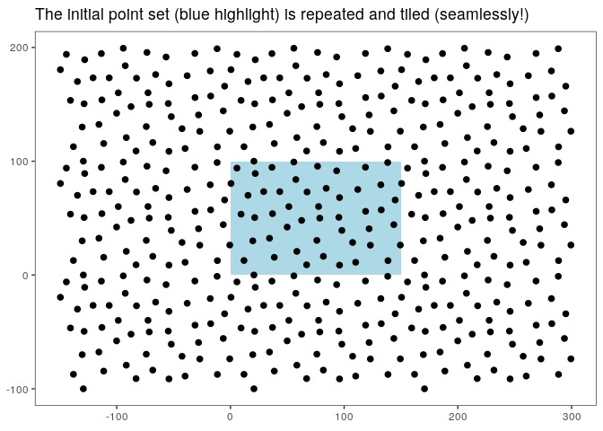
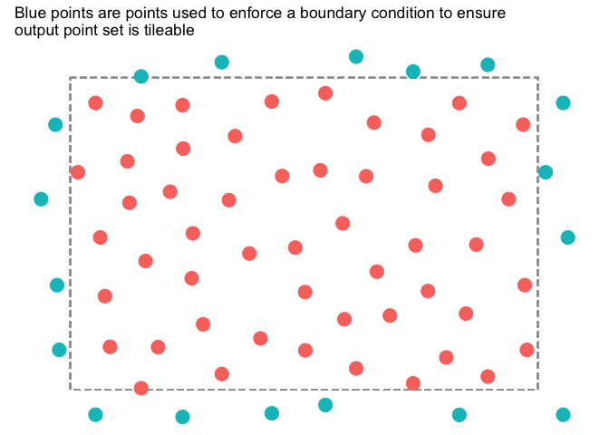

<!-- README.md is generated from README.Rmd. Please edit that file -->

# poissoned

<!-- badges: start -->

<!-- badges: end -->

`poissoned` is an Rstats implementation of the poisson disk sampling
algorithm from [Bridson’s paper - Fast Poisson Disk Sampling in
Arbitrary
Dimensions](https://www.cs.ubc.ca/~rbridson/docs/bridson-siggraph07-poissondisk.pdf)

Notes:

  - only implemented the 2d case
  - adjusted the algorithm in order to ensure repeatable/tileable
    samples with minimal artifacts at the joins
  - similar in purpose to [Will Chase’s](https://twitter.com/W_R_Chase)
    package
    [{poissondisc}](https://github.com/will-r-chase/poissondisc).
    However, `poissoned` has a a completely different implementation
    which ends up being much faster.

## Installation

You can install from
[GitHub](https://github.com/coolbutuseless/poissoned) with:

``` r
# install.packages("devtools")
devtools::install_github("coolbutuseless/poissoned")
```

## Basic Usage

``` r
library(poissoned)

set.seed(1)
points <- poissoned::poisson_disc(ncols = 50, nrows = 35, cell_size = 10, verbose = TRUE)
#> poisson_disc(): 500x350, minimum distance = 14.14

ggplot(points) +
  geom_point(aes(x, y)) +
  theme_bw() +
  coord_fixed() +
  theme(
    panel.grid = element_blank(),
    axis.title = element_blank()
  ) 
```


# Tileability

The points generated from `poissoned::poisson_disc()` are tileable in
that there should be minimal artifacts at the joins.

In the graph below, the initial set of points (highlighted in blue) was
manually replicated and offset eight times.



# Tileability - details

Tileability is achieved by copying edge points to outside the opposite
edge - this simulates a toroidal coordinate system such that the canvas
wraps around on itself.

These boundary points are retrievable by setting `keep_boundary = TRUE`.

In the following plot, the dashed line indicates the limits of the point
set, and the blue points are translated points copied from the opposite
edge.

``` r
points <- poissoned::poisson_disc(ncols = 15, nrows = 10, cell_size = 20, 
                                  keep_boundary = TRUE, verbose = TRUE)
#> poisson_disc(): 300x200, minimum distance = 28.28

ggplot(points) +
  geom_rect(xmin = 0, xmax = 300, ymin = 0, ymax = 200, fill = NA, colour = '#a0a0a0', linetype = 2) + 
  geom_point(aes(x, y, colour = boundary), size = 5) +
  theme_void() +
  coord_fixed() +
  theme(legend.position = 'none') +
  labs(title = "Blue points are points used to enforce a boundary condition to ensure \noutput point set is tileable")
```



# Point discovery order

New points are generated through an iterative process. `poisson_disc()`
can return the order in which points were generated using the `keep_idx`
argument.

It is also possible to pass in the seed point to initialise the process.
If a seed point is not given, then a random point will be
chosen.

``` r
points <- poissoned::poisson_disc(ncols = 120, nrows = 80, cell_size = 10, 
                                  xinit = 600, yinit = 400,
                                  keep_idx = TRUE, verbose = TRUE)
#> poisson_disc(): 1200x800, minimum distance = 14.14

nrow(points)
#> [1] 3223

ggplot(points) +
  geom_point(aes(x, y, colour = idx)) +
  theme_void() +
  coord_fixed() +
  theme(legend.position = 'none') +
  scale_color_viridis_c() +
  labs(title = "Seed point at centre. Points coloured by discovery order.")
```


