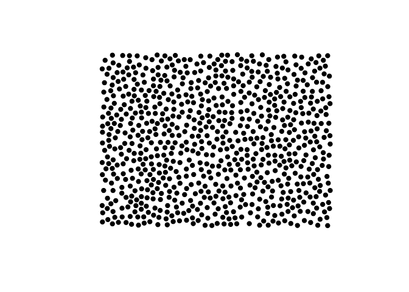

<!-- README.md is generated from README.Rmd. Please edit that file -->

# poissoned

<!-- badges: start -->


[](https://CRAN.R-project.org/package=poissoned)
[](https://github.com/coolbutuseless/poissoned/actions/workflows/R-CMD-check.yaml)
<!-- badges: end -->

## Multi-dimensional poisson disc sampling

`poissoned` is an R implementation of the poisson disk sampling
algorithm from [Bridson’s paper - Fast Poisson Disk Sampling in
Arbitrary
Dimensions](https://www.cs.ubc.ca/~rbridson/docs/bridson-siggraph07-poissondisk.pdf)

### What’s in the box

- `poisson2d()` for the 2D case
- `poisson3d()` for the 3D case

## Installation

You can install from
[GitHub](https://github.com/coolbutuseless/poissoned) with:

``` r
# install.packages("devtools")
devtools::install_github("coolbutuseless/poissoned")
```

## Basic Usage

``` r
library(poissoned)

set.seed(1)
points <- poissoned::poisson2d(ncols = 50, nrows = 35, cell_size = 10, verbosity = 1)
#> poisson2d(): 500x350, minimum distance = 14.14

ggplot(points) +
  geom_point(aes(x, y)) +
  theme_bw() +
  coord_fixed() +
  theme(
    panel.grid = element_blank(),
    axis.title = element_blank()
  ) 
```



# Point discovery order

New points are generated through an iterative process. `poisson2d()` can
return the order in which points were generated using the `keep_idx`
argument.

It is also possible to pass in the seed point to initialise the process.
If a seed point is not given, then a random point will be chosen.

``` r
points <- poissoned::poisson2d(ncols = 120, nrows = 80, cell_size = 10, 
                                  xinit = 600, yinit = 400,
                                  keep_idx = TRUE, verbosity = 1)
#> poisson2d(): 1200x800, minimum distance = 14.14

nrow(points)
#> [1] 3257

ggplot(points) +
  geom_point(aes(x, y, colour = idx)) +
  theme_void() +
  coord_fixed() +
  theme(legend.position = 'none') +
  scale_color_viridis_c() +
  labs(title = "Seed point at centre. Points coloured by discovery order.")
```


