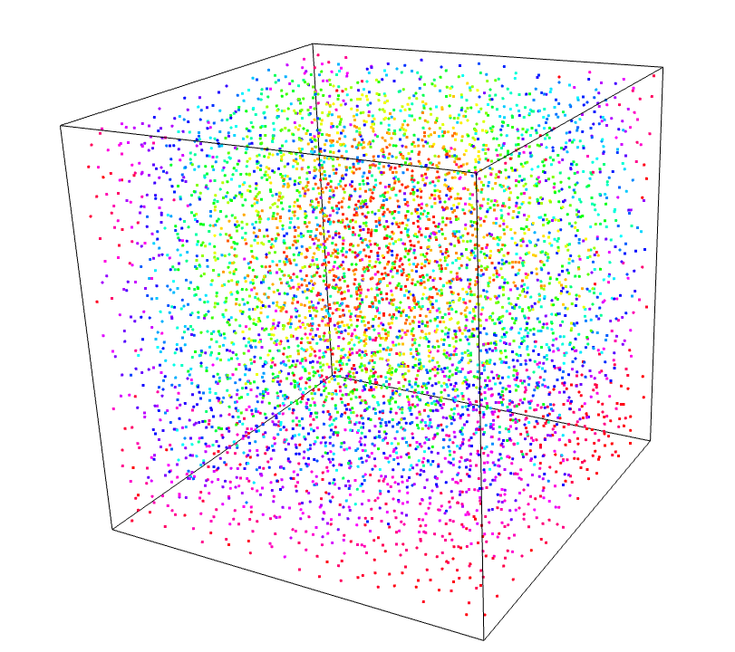

<!-- README.md is generated from README.Rmd. Please edit that file -->

# poissoned

<!-- badges: start -->


[](https://CRAN.R-project.org/package=poissoned)
[](https://github.com/coolbutuseless/poissoned/actions/workflows/R-CMD-check.yaml)
<!-- badges: end -->

## Multi-dimensional Poisson disk sampling

`poissoned` is an R implementation of the Poisson disk sampling
algorithm from [Bridson’s paper - Fast Poisson Disk Sampling in
Arbitrary
Dimensions](https://www.cs.ubc.ca/~rbridson/docs/bridson-siggraph07-poissondisk.pdf)

### What’s in the box

- `poisson2d()` for the 2D case
- `poisson3d()` for the 3D case

## Installation

You can install from
[GitHub](https://github.com/coolbutuseless/poissoned) with:

``` r
# install.packages("devtools")
devtools::install_github("coolbutuseless/poissoned")
```

## 2D Poisson Disk Sampling

``` r
library(poissoned)
pts <- poisson2d(w = 80, h = 60, r = 2)

par(mai = c(0, 0, 0, 0))
plot(pts, asp = 1, ann = FALSE, axes = FALSE, pch = 19, cex = 0.5)
```


## 3D Poisson Disk Sampling

``` r
library(rgl)
library(poissoned)

set.seed(1)
pts <- poisson3d(w = 10, h = 10, d = 10, r = 0.5)
rgl::points3d(pts, color = rainbow(nrow(pts)))
rgl::box3d()
```


